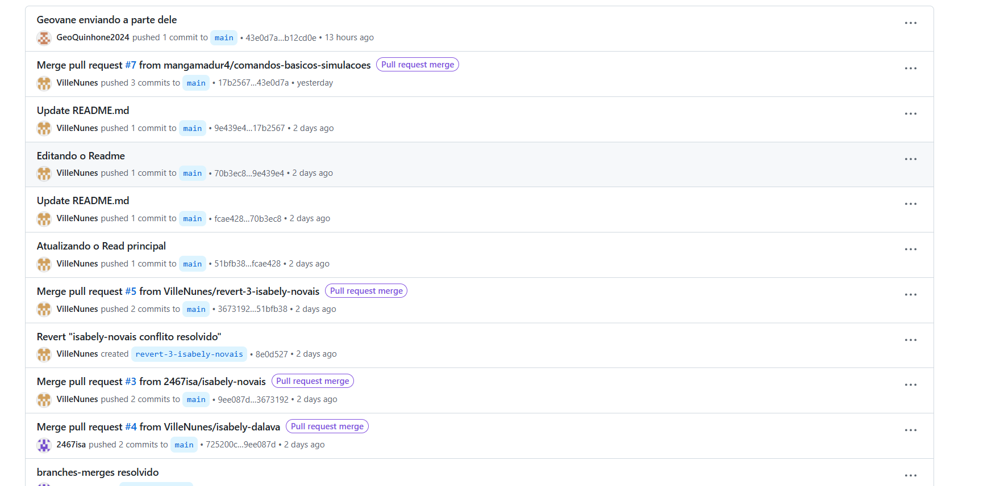
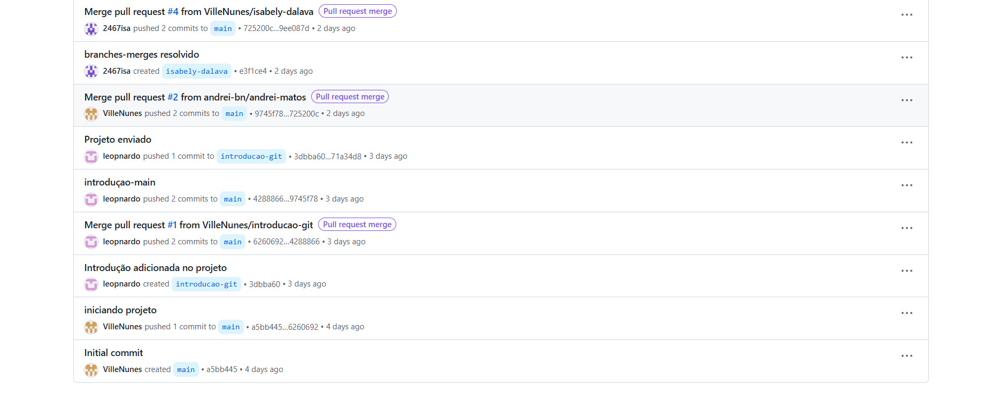

# ⭐ **Trabalho DevOps — Manual Prático de Git**

## 📘 Sobre o Projeto

Este repositório tem como objetivo desenvolver um **manual prático e acessível sobre o uso do Git**, abordando desde os conceitos fundamentais até tópicos mais avançados como **branches**, **merges** e **pull requests** no GitHub.

A proposta é que o próprio manual seja **versionado com Git**, permitindo aplicar na prática o que está sendo aprendido.

---

## 📚 Conteúdo do Manual com links

1. 🧭 [**Introdução ao Git e ao Controle de Versão**](https://github.com/VilleNunes/manual-git-groupo-03/blob/main/introducao.md)  
2. 🛠️ [**Instalação e Configuração do Git**](https://github.com/VilleNunes/manual-git-groupo-03/blob/main/instalacao-configuracao.md) 
3. 🧩 [**Comandos Básicos do Git**](https://github.com/VilleNunes/manual-git-groupo-03/blob/main/comandos-basicos.md)
4. 🌿 [**Branches e Merge**](https://github.com/VilleNunes/manual-git-groupo-03/blob/main/branches-merges.md) 
5. ☁️ [**GitHub e Pull Requests**](https://github.com/VilleNunes/manual-git-groupo-03/blob/main/pull-requests.md)

---
# Imagens dos históricos do GitHub

# 👨‍💻 Integrantes do Grupo

| 👤 Nome                               | 🎓 RA     | 🔗 GitHub                              |
|--------------------------------------|----------|----------------------------------------|
| Leonardo Dos Santos Barbosa          | 240020   | [leopnardo](https://github.com/leopnardo) |
| Andrei Matos Costas                  | 14564    | [andrei-bn](https://github.com/andrei-bn) |
| Ville Nunes Figueiredo da Silva      | 5432     | [VilleNunes](https://github.com/VilleNunes) |
| Eduardo Vergentino Malaquias         | 14532    | [mangamadur4](https://github.com/mangamadur4) |
| Isabely Novais Dalava                | 14611    | [2467isa](https://github.com/2467isa) |
| Geovane de Lucas Quinhone Ker        | 14511    | [Geovane](https://github.com/GeoQuinhone2024)                |

---

## ✅ Observações

- 📁 Cada tema abordado será documentado em arquivos Markdown neste repositório.
- 🔀 O projeto utilizará **branches** e **pull requests** para simular o fluxo de trabalho real em equipes.
- 🤝 Contribuições serão feitas via fork, commits e revisões, como parte da prática DevOps.

---
